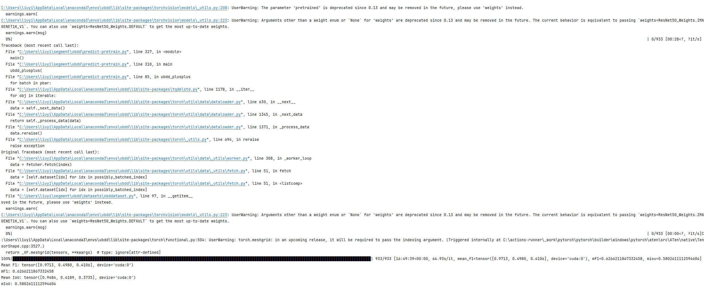

CUDA_VISIBLE_DEVICES=0 python predict-pretrain.py --test-set-path "./xbd/test" --dino-path "./ubdd-dino-resnet.pth" --dino-config "./models/dino/config/DINO_4scale_UBDD_resnet.py" --sam-path "./checkpoints/SAM/sam_vit_h_4b8939.pth"

python predict-pretrain.py --test-set-path "./xbd/mydata" --dino-path "./ubdd-dino-resnet.pth" --dino-config "./models/dino/config/DINO_4scale_UBDD_resnet.py" --sam-path "./checkpoints/SAM/sam_vit_h_4b8939.pth" --save-annotations
保存结果